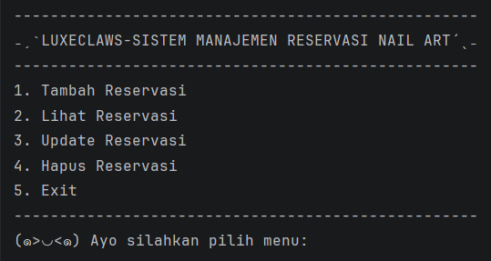
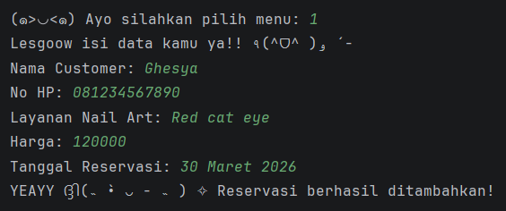
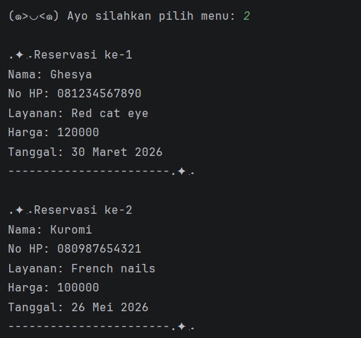
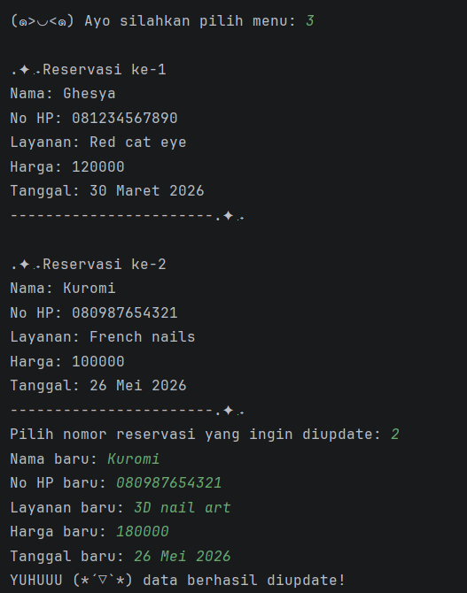
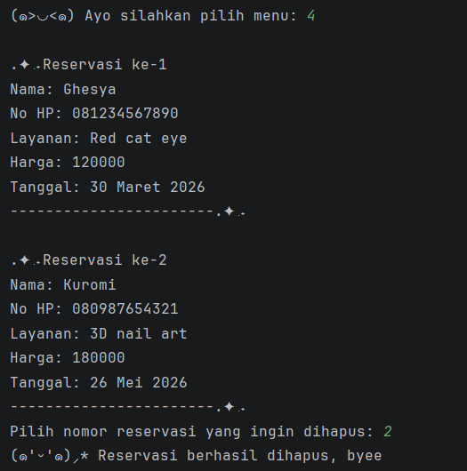
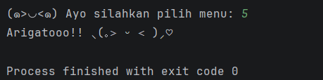

# ₊˚⊹ ᰔ LuxeClaws - Sistem Manajemen Reservasi Nail Art

Program ini merupakan aplikasi berbasis **Java** yang digunakan untuk mengelola data reservasi layanan nail art pada sebuah salon.  
Program dibuat sebagai **Posttest 1 Praktikum Pemrograman Berorientasi Objek (PBO)** dengan menerapkan konsep **Object Oriented Programming (OOP)** dan penggunaan **ArrayList** sebagai media penyimpanan data.

---

# ⋆˚࿔ Deskripsi Program

Sistem ini memungkinkan pengguna untuk melakukan pengelolaan data reservasi nail art melalui menu yang tersedia di terminal.

Program akan terus berjalan hingga pengguna memilih **menu Exit**.

Data yang dikelola pada sistem ini meliputi:
- Data pelanggan
- Data layanan nail art
- Tanggal reservasi

---

# ⋆˚࿔ Fitur Program

Program ini memiliki fitur utama berupa **CRUD (Create, Read, Update, Delete)** terhadap data reservasi.

### 1. Create (Tambah Reservasi)
Menambahkan data reservasi baru yang berisi:
- Nama customer
- Nomor HP
- Jenis layanan nail art
- Harga layanan
- Tanggal reservasi

### 2. Read (Lihat Reservasi)
Menampilkan seluruh data reservasi yang telah tersimpan di dalam sistem.

### 3. Update (Perbarui Reservasi)
Mengubah data reservasi yang sudah ada.

### 4. Delete (Hapus Reservasi)
Menghapus data reservasi dari sistem.

---

# ⋆˚࿔ Struktur Class

Program ini menggunakan beberapa class untuk menerapkan konsep **Object Oriented Programming**.

### 1. Customer
Class ini digunakan untuk menyimpan data pelanggan.

Atribut:
- `nama`
- `noHp`

---

### 2. NailArtService
Class ini digunakan untuk menyimpan data layanan nail art.

Atribut:
- `namaLayanan`
- `harga`

---

### 3. Reservation
Class ini digunakan untuk menyimpan data reservasi yang menghubungkan customer dengan layanan nail art.

Atribut:
- `customer`
- `layanan`
- `tanggal`

---

### 4. Main
Class utama yang berisi:
- Menu program
- Pengolahan CRUD
- Penyimpanan data menggunakan **ArrayList**

---

# ⋆˚࿔ Tampilan Program

### Menu Program

---

### Tambah Reservasi

---

### Lihat Reservasi

---

### Update Reservasi

---

### Hapus Reservasi

---

### Exit

---

Made with love by **Ghesya Rhegyta Al Rachman** ₍ᐢ. .ᐢ₎ ₊˚⊹♡

