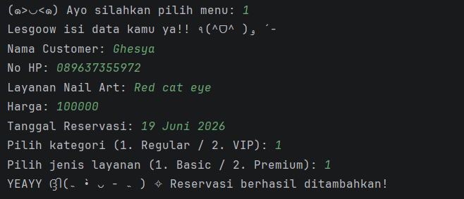
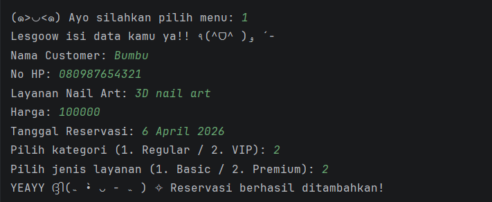
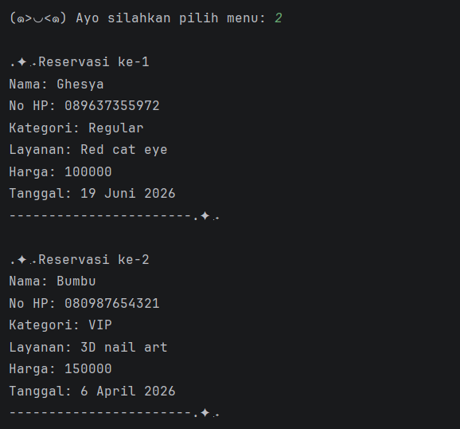
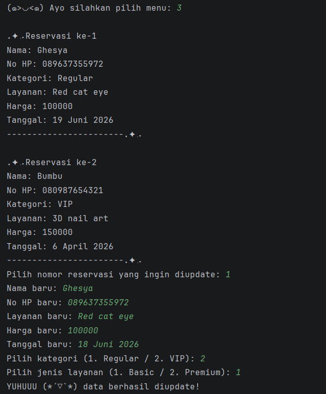
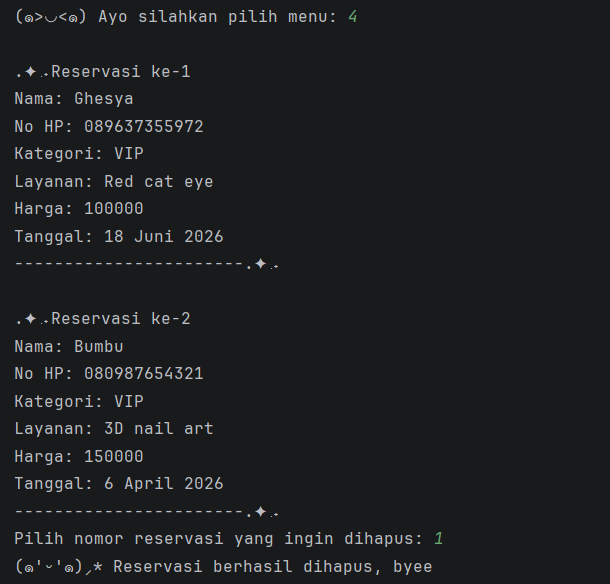
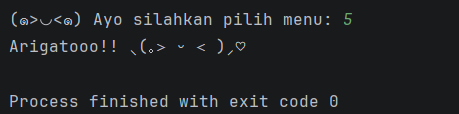

# ₊˚⊹ ᰔ LuxeClaws - Sistem Manajemen Reservasi Nail Art

Program ini merupakan aplikasi berbasis **Java** yang digunakan untuk mengelola data reservasi layanan nail art pada sebuah salon.

Program dibuat sebagai **Posttest 3 Praktikum Pemrograman Berorientasi Objek (PBO)** dengan menerapkan konsep **Object Oriented Programming (OOP)**, yaitu:
- Encapsulation
- Inheritance
- Access Modifier
- Getter dan Setter 

Data reservasi pada sistem ini disimpan sementara menggunakan **ArrayList**.

---

# ⋆˚࿔ Deskripsi Program

Sistem ini memungkinkan pengguna untuk melakukan pengelolaan data reservasi nail art melalui menu yang tersedia di terminal.

Program akan terus berjalan hingga pengguna memilih **menu Exit**.

Data yang dikelola pada sistem ini meliputi:
- Data customer (Regular & VIP)
- Data layanan (Basic & Premium)
- Harga layanan
- Tanggal reservasi

---

# ⋆˚࿔ Fitur Program

Program ini memiliki fitur utama berupa **CRUD (Create, Read, Update, Delete)** terhadap data reservasi.

### 1. Create (Tambah Reservasi)
Menambahkan data reservasi baru:
- Nama customer
- Nomor HP
- Kategori customer (Regular / VIP)
- Jenis layanan (Basic / Premium)
- Harga layanan
- Tanggal reservasi

### 2. Read (Lihat Reservasi)
Menampilkan seluruh data reservasi:
- Nama
- No HP
- Kategori customer
- Layanan
- Harga
- Tanggal

### 3. Update (Perbarui Reservasi)
Mengubah data reservasi yang sudah ada.

### 4. Delete (Hapus Reservasi)
Menghapus data reservasi dari sistem.

---

# ⋆˚࿔ Struktur Class

Program ini menggunakan beberapa class untuk menerapkan konsep Object Oriented Programming.

### 1. Customer (Parent Class)
Class ini digunakan untuk menyimpan data pelanggan.

Atribut:
- `nama`
- `noHp`
- `kategori`

Class ini menjadi parent dari:
- RegularCustomer
- VIPCustomer

---

### 2. RegularCustomer (Child Class)
Turunan dari class Customer yang merepresentasikan pelanggan biasa.

---

### 3. VIPCustomer (Child Class)
Turunan dari class Customer yang merepresentasikan pelanggan VIP.

---

### 4. NailArtService (Parent Class)
Class ini digunakan untuk menyimpan data layanan nail art.

Atribut:
- `namaLayanan`
- `harga`

Class ini menjadi parent dari:
- BasicService
- PremiumService

---

### 5. BasicService (Child Class)
Turunan dari NailArtService yang merepresentasikan layanan biasa.

---

### 6. PremiumService (Child Class)
Turunan dari NailArtService yang memiliki tambahan biaya.

---

### 7. Reservation
Class ini digunakan untuk menghubungkan:
- Customer
- Layanan
- Tanggal reservasi

---

### 8. Main
Class utama yang berisi:
- Menu program
- Proses CRUD
- Pengelolaan data menggunakan ArrayList

---

# ⋆˚࿔ Tampilan Program

### Menu Program

---

### Tambah Reservasi

---

### Lihat Reservasi

---

### Update Reservasi

---

### Hapus Reservasi

---

### Keluar Program

---

# ⋆˚࿔ Konsep OOP yang Digunakan

Program ini menerapkan beberapa konsep dasar **Object Oriented Programming**, yaitu:

- Class dan Object
- Encapsulation
- Inheritance
- Access Modifier
- Getter dan Setter
- ArrayList sebagai penyimpanan data
- Modularisasi program

---

Made with love by **Ghesya Rhegyta Al Rachman** ₍ᐢ. .ᐢ₎ ₊˚⊹♡