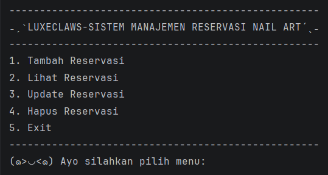
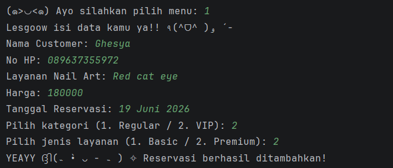
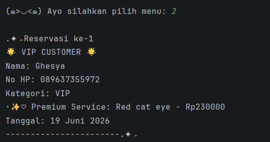
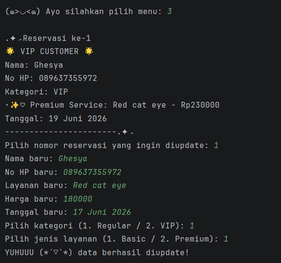
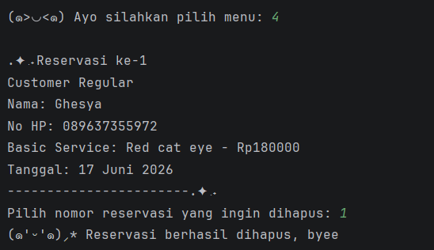

# ₊˚⊹ ᰔ LuxeClaws - Sistem Manajemen Reservasi Nail Art

Program ini merupakan aplikasi berbasis **Java** yang digunakan untuk mengelola data reservasi layanan nail art pada sebuah salon.

Program dibuat sebagai **Posttest 4 Praktikum Pemrograman Berorientasi Objek (PBO)** dengan menerapkan konsep **Object Oriented Programming (OOP)** meliputi **Encapsulation**, **Inheritance**, serta **Polymorphism (Overloading & Overriding)**

Data reservasi pada sistem ini disimpan sementara menggunakan **ArrayList**.

---

# ⋆˚࿔ Deskripsi Program

Sistem ini memungkinkan pengguna untuk melakukan pengelolaan data reservasi nail art melalui menu yang tersedia di terminal.

Program akan terus berjalan hingga pengguna memilih **menu Exit**.

Data yang dikelola pada sistem ini meliputi:
- Data pelanggan
- Kategori pelanggan (Regular / VIP)
- Data layanan nail art (Basic / Premium)
- Harga layanan
- Tanggal reservasi

---

# ⋆˚࿔ Fitur Program

Program ini memiliki fitur utama berupa **CRUD (Create, Read, Update, Delete)** terhadap data reservasi.

### 1. Create (Tambah Reservasi)
Menambahkan data reservasi baru yang berisi:
- Nama customer
- Nomor HP
- Kategori customer (Regular / VIP)
- Jenis layanan nail art (Basic / Premium)
- Harga layanan
- Tanggal reservasi (dapat dikosongkan))

### 2. Read (Lihat Reservasi)
Menampilkan seluruh data reservasi yang telah tersimpan di dalam sistem.

### 3. Update (Perbarui Reservasi)
Mengubah data reservasi yang sudah ada.

### 4. Delete (Hapus Reservasi)
Menghapus data reservasi dari sistem.

---

# ⋆˚࿔ Struktur Class

Program ini menggunakan beberapa class untuk menerapkan konsep **Object Oriented Programming**.

### 1. Customer
Class ini digunakan untuk menyimpan data pelanggan.

Atribut:
- `nama`
- `noHp`
- `kategori`

Class ini menjadi parent class dari :
- `RegularCustomer`
- `VIPCustomer`

---

### 2. RegularCustomer & VIPCustomer
Merupakan turunan dari class Customer.

Digunakan untuk membedakan kategori pelanggan:
- `Regular`
- `VIP`

Pada class ini diterapkan Method Overriding untuk menampilkan informasi customer sesuai kategorinya.

---

### 3. NailArtService
Class ini digunakan untuk menyimpan data layanan nail art.

Atribut:
- `namaLayanan`
- `harga`

Class ini menjadi parent class dari :
- `BasicService`
- `PremiumService`

---

### 4. BasicService & PremiumService
Merupakan turunan dari class NailArtService.
- `BasicService` → layanan biasa
- `PremiumService` → layanan dengan tambahan harga

Pada class ini diterapkan Method Overriding untuk menampilkan detail layanan yang berbeda

---

### 5. Reservation
Class ini digunakan untuk menyimpan data reservasi yang menghubungkan customer dengan layanan nail art serta tanggal reservasi.

Atribut:
- `customer`
- `layanan`
- `tanggal`

Pada class ini diterapkan:
- `Method Overloading (Constructor)`
- Dengan tanggal
- Tanpa tanggal (default: Belum ditentukan)
- `Method Overloading (Method tampilkanReservasi)`
- Versi detail
- Versi singkat

---

### 6. Main
Class utama yang berisi:
- Menu program
- Pengolahan CRUD
- Penyimpanan data menggunakan **ArrayList**

Class ini juga menangani interaksi pengguna melalui terminal.

---

# ⋆˚࿔ Tampilan Program

### Menu Program

---

### Tambah Reservasi

---

### Lihat Reservasi

---

### Update Reservasi

---

### Hapus Reservasi

---

# ⋆˚࿔ Konsep OOP yang Digunakan

Program ini menerapkan konsep **Object Oriented Programming**, yaitu:

- Class dan Object
- Encapsulation
- Inheritance 
- Polymorphism (Method Overriding (Customer & Service) & Method Overloading (Reservation))
- ArrayList sebagai penyimpanan data
- Modularisasi program
- Access Modifier (public, private, protected, default)

---

Made with love by **Ghesya Rhegyta Al Rachman** ₍ᐢ. .ᐢ₎ ₊˚⊹♡