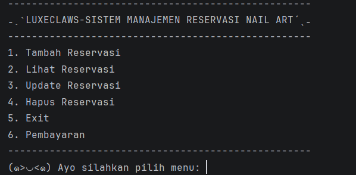
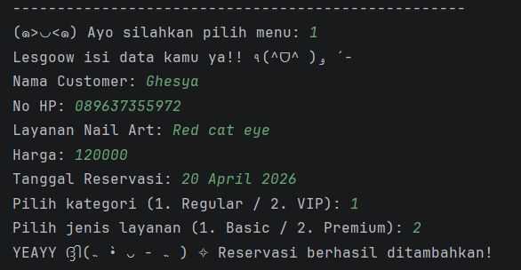
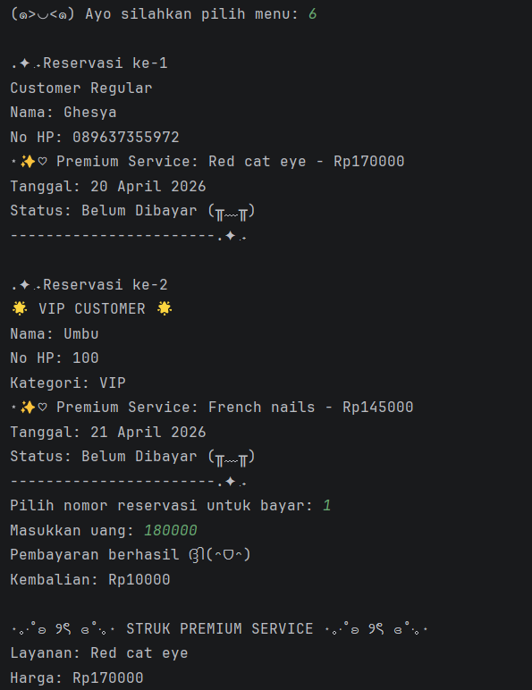
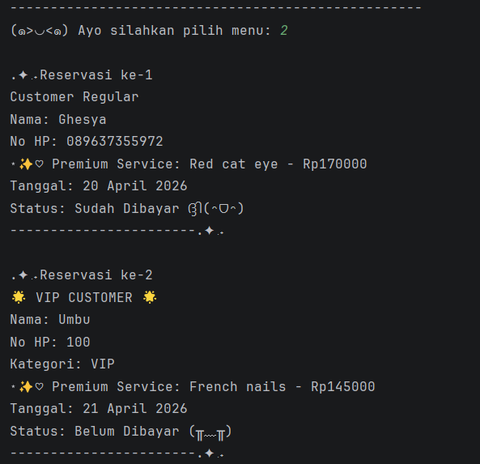
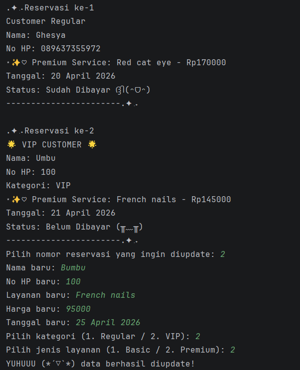
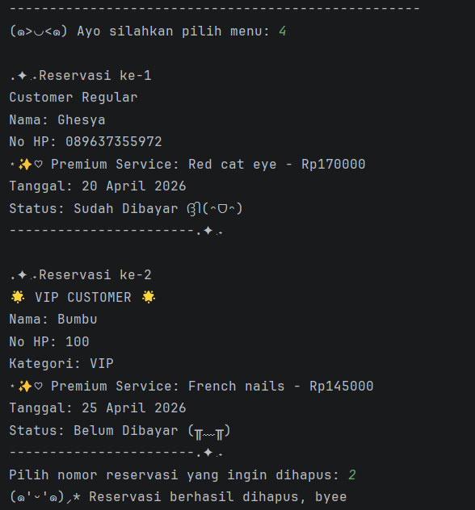
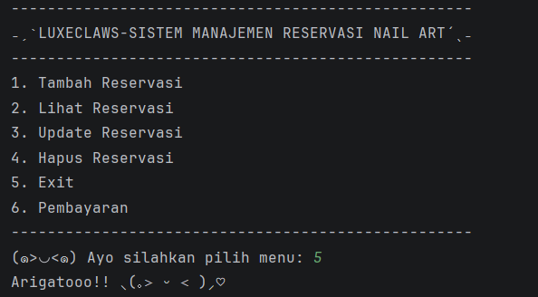

# ₊˚⊹ ᰔ LuxeClaws - Sistem Manajemen Reservasi Nail Art ₊˚⊹ ᰔ

Program ini merupakan aplikasi berbasis **Java** yang digunakan untuk mengelola data reservasi layanan nail art pada sebuah salon.

Program ini dibuat sebagai **Posttest 5 Praktikum Pemrograman Berorientasi Objek (PBO)** dengan menerapkan konsep:

- Encapsulation
- Inheritance
- Polymorphism (Overloading & Overriding)
- Abstract Class
- Interface

Data disimpan sementara menggunakan **ArrayList**.

---

## ⋆˚࿔ Deskripsi Program

Sistem ini memungkinkan pengguna untuk mengelola reservasi nail art melalui menu terminal.

Program akan terus berjalan hingga pengguna memilih **Exit**.

Fitur tambahan pada versi ini:
- Sistem pembayaran
- Status pembayaran (sudah / belum)
- Cetak struk
- Validasi agar tidak bisa bayar 2x

---

## ⋆˚࿔ Fitur Program

### 1. Tambah Reservasi
Menambahkan data:
- Nama customer
- No HP
- Kategori (Regular / VIP)
- Layanan (Basic / Premium)
- Harga
- Tanggal (opsional)

---

### 2. Lihat Reservasi
Menampilkan seluruh data termasuk:
- Detail customer
- Layanan
- Status pembayaran

---

### 3. Update Reservasi
Mengubah data reservasi yang sudah ada.

---

### 4. Hapus Reservasi
Menghapus data dari sistem.

---

### 5. Pembayaran
Fitur pembayaran meliputi:
- Input uang
- Validasi cukup / kurang
- Menampilkan kembalian
- Cetak struk
- Mencegah pembayaran ulang

---

## ⋆˚࿔ Struktur Class

### 1. Customer
Menyimpan data pelanggan:
- nama
- noHp
- kategori

Parent class dari:
- RegularCustomer
- VIPCustomer

---

### 2. RegularCustomer & VIPCustomer
Turunan dari Customer.

Menggunakan **method overriding** untuk menampilkan info berbeda.

---

### 3. NailArtService (Abstract Class)
Class abstract untuk layanan.

Atribut:
- namaLayanan
- harga

Method:
- getDetailService() (abstract)

---

### 4. BasicService & PremiumService
Turunan dari NailArtService.

Menggunakan:
- Method overriding
- Implementasi interface

---

### 5. Pembayaran (Interface)
Berisi method:
- bayar(int jumlah)
- cetakStruk()

Diimplementasikan oleh:
- BasicService
- PremiumService

---

### 6. Reservation
Menghubungkan:
- Customer
- Layanan
- Tanggal

Fitur:
- Overloading constructor
- Overloading method tampilkan
- Status pembayaran
- Integrasi interface pembayaran

---

### 7. Main
Mengatur:
- Menu program
- CRUD
- Pembayaran
- Penyimpanan data (ArrayList)

---

## ⋆˚࿔ Konsep OOP

- Class & Object
- Encapsulation
- Inheritance
- Polymorphism
- Abstract Class
- Interface
- ArrayList
- Modular Programming

---

## ⋆˚࿔ Keunggulan

- Tampilan aesthetic di terminal
- Sistem pembayaran lengkap
- Anti double payment
- Struktur rapi & modular
- Implementasi OOP lengkap

---

## ⋆˚࿔ Preview

### Menu

### Tambah

### Bayar

### Lihat

### Update

### Hapus

### Keluar

---

Made with love by **Ghesya Rhegyta Al Rachman** ₍ᐢ. .ᐢ₎ ₊˚⊹♡